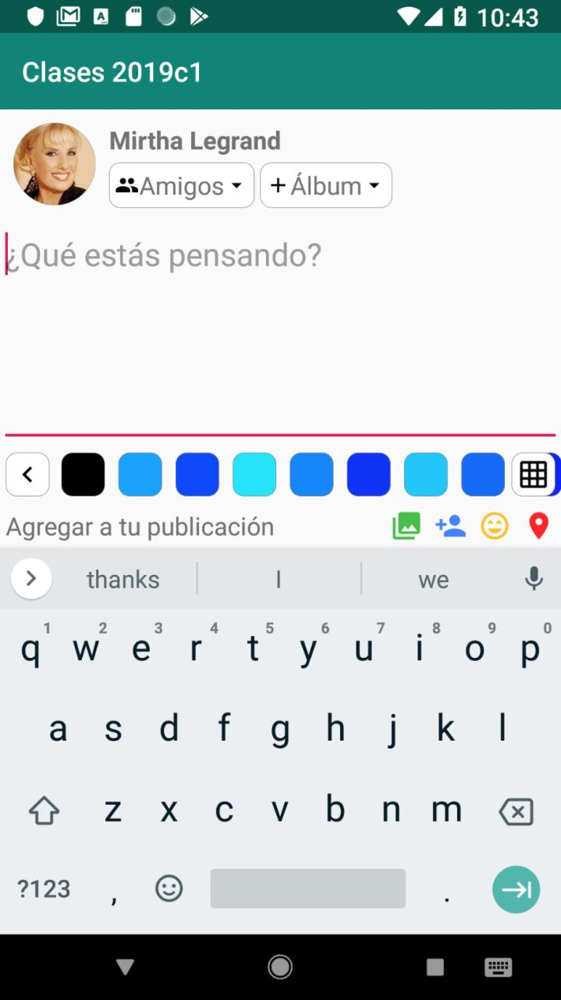

# Clases-2021c1
Prácticas de la materia - 1° Cuatrimestre 2021

## Práctica de layouts

Este proyecto contiene una pequeña aplicación que muestra una pantalla similar a la de una nueva
publicación en Facebook. El layout está incompleto y hay que completarlo para que luzca así:



### View

El layout que vamos a modificar es fragment_status_update.xml. No es necesario cambiar la
estructura del mismo, sino agregar los atributos que hagan falta a los elementos existentes. Si
bien hay más tipos de Layouts distintos, en este ejemplo vamos a ver FrameLayout, LinearLayout
y RelativeLayout.

Los atributos de un elemento que comienzan con `layout_` indican al contenedor cómo debe desplegar
ese elemento. Hay dos obligatorios: `layout_width` y `layout_height` que indican el tamaño que
ocupa esa subvista. Los valores que acepta son dimensiones o alguno de los valores especiales
`wrap_content` (que ajusta al contenido) o `match_parent` (que toma el tamaño del contenedor).
El resto de los atributos `layout_` dependen del tipo de contenedor.

Los atributos que explicamos a continuación se utilizan en la subvista si comienzan con `layout_`
o en el contenedor en caso contrario. De más está decir que no son todos los atributos que van a
encontrar, pero sí los más comunes.

#### FrameLayout

Las subvistas se apilan una encima de la otra.

Se puede especificar la alineación de las subvistas
usando el atributo `gravity` (para todas las subvistas) o `layout_gravity` (para una subvista).

#### LinearLayout

Las subvistas se despliegan una a continuación de la otra.

El atributo principal es `orientation` (horizontal o vertical). Además de la alineación con
`gravity` y `layout_gravity` (solo en el eje normal al que distribuye) también se puede distribuir
el espacio libre entre subvistas con `layout_weight` y `weightSum`. El espacio que no ocupan las
subvistas sin `layout_weight` se distribuye entre las que sí lo tienen proporcionalmente según su
peso. Si `weightSum` se omite calcula la suma automáticamente.

Se recomienda no usar `match_parent` en las subvistas en el mismo eje donde se distribuyen las
subvistas.

#### RelativeLayout

Las subvistas se despliegan en relación al contenedor u otras subvistas. Para cada subvista hay que
indicar al menos una relación para cada eje.

`layout_alignParentStart` (a la izquierda LTR), `layout_alignParentEnd` (a la derecha LTR),
`layout_alignParentTop` (hacia arriba) y `layout_alignParentBottom` (hacia abajo),
`layout_centerHorizontal` (centro horizontal), `layout_centerVertical` (centro vertical) llevan
`true` cuando queremos que la subvista se pegue a alguno de los bordes o centro del contenedor.

Otros atributos `layout_` reciben una referencia a otra subvista. Esto requiere que la subvista a
referenciar tenga un id. Para alinear a otra subvista se usan los atributos `layout_alignStart`,
`layout_alignEnd`, `layout_alignTop`, `layout_alignBottom` o `layout_alignBaseline` (alinea las
bases del contenido). Para poner una subvista al lado de otra se utilizan `layout_toEndOf`,
`layout_toStartOf`, `layout_above` o `layout_below`.

### Compose

En Compose tenemos que modificar `StatusUpdateScreen.kt`. Ahí vamos a ver una preview más parecida
a lo que queremos lograr, pero mal distribuida. Para corregirla tenemos que agregar `modifier`s a
los elementos de UI.

Todos (o casi todos) los elementos de UI aceptan un parámetro `modifier` que permite alterar el
posicionamiento, tamaño, distribución, entre otras cosas. Se aplica así:

```
MiUI(
    // otros parámetros
    modifier = Modifier.modificador())
```

Los modifiers se aplican en el orden en que son declarados. Esto implica que si un padding se aplica
antes que un background entonces el background también reduce (resultando en un margin) pero si se
aplica después el padding aplica solo al elemento de UI y el background es más grande.
En este sentido, los modifiers no cambian propiedades del elemento de UI sino que son agregados al
elemento de UI. Por ejemplo, si aplico varias veces `background()` voy a agregar varios fondos, no
reemplazar los anteriores. Esto se puede notar si los fondos no son transparentes y/o tienen distinto
padding, ya que se van a poder ver los diferentes fondos.

Es una buena práctica agregar `modifier` a tus composables que tengan elementos de UI, trasladando
el argumento al primer elemento de UI que se use.

#### padding()

Aplica un padding o márgen al elemento. Los modificadores aplicados a partir de ahí (y el propio 
elemento de UI) se rellena alrededor.
Para aplicar lo que en HTML u otras tecnologías sería padding y margin se podría hacer lo siguiente:
```
Modifier.padding(/* el margin acá */)
    .background(/* el background */)
    .padding(/* el padding acá */)
```

#### size()

Sirve para aplicar/forzar el tamaño del elemento. Por omisión el elemento trata de tener un tamaño
donde entre su contenido pero si queremos especificar el mismo podemos usar `size`, `width` o `height`
en alguna de sus variantes:
* `size()`, `width()`, `height()`: define el tamaño preferido, que puede ser pisado por alguna otra constraint.
* `sizeIn()`, `widthIn()`, `heightIn()`: define un rango preferido de tamaño. Otra constraint más restrictiva
lo puede pisar.
* `requiredSize()`,  `requiredWidth()`, `requiredHeight()`: define el tamaño requerido. No lo puede romper otra
constraint.
* `requiredSizeIn()`, `requiredWidthIn()`, `requiredHeightIn()`: define un rango requerido de tamaño.
* `fillMaxSize()`, `fillMaxWidth()`, `fillMaxHeight()`: rellena el espacio disponible del contenedor o una
fracción del mismo.
* `wrapContentSize()`, `wrapContentWidth()`, `wrapContentHeight()`: que use su tamaño natural.
* `defaultMinSize()`: permite definir un tamaño mínimo por default pero sin restringir a que se pise después.

#### border()

Agrega un borde al elemento.

#### background()

Agrega un fondo al elemento.

#### clip()

Recorta el elemento a la forma dada.

#### Modificadores específicos

Algunos modificadores son específicos del contenedor, es decir, solo pueden usarse dentro de cierto contenedor.
```
Box { // this: BoxScope
}
Row { // this: RowScope
}
```
Cada contenedor puede definir su propio scope y esos scopes son los que hacen visibles estos modificadores
específicos.

`Box` permite alinear sus hijos con `align()` o que ocupen todo el tamaño con `matchParentSize()`.

`Row` permite alinear sus hijos con `align()` o `alignBy()` (que permite alinear, por ejemplo, la baseline,
que es la línea sobre la que se escribe un texto). También repartir el espacio horizontal disponible con
`weigth()` tal como lo hace un `LinearLayout`.

`Column` lo mismo que `Row` pero en vertical en vez de Horizontal.
